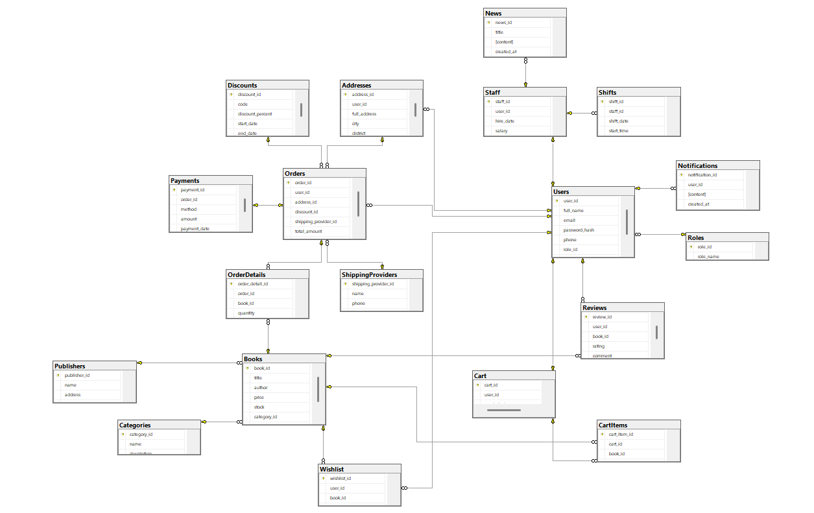

PRJ301_Bookstore_Management_System

### Database Diagram



> [!NOTE]
> Bookstore Management System `demo`.

```markdown
BookstoreProject/
├── src/
│   ├── java/
│   │   ├── controller/                    # 17 Controller cho 17 Model chính + 1 Main
│   │   │   ├── AddressController.java     
│   │   │   ├── BookController.java        
│   │   │   ├── CartController.java        
│   │   │   ├── CategoryController.java    
│   │   │   ├── DiscountController.java    
│   │   │   ├── MainController.java        # Nơi đón toàn bộ request đầu tiên
│   │   │   ├── NewsController.java        
│   │   │   ├── NotificationController.java
│   │   │   ├── OrderController.java       
│   │   │   ├── PaymentController.java     
│   │   │   ├── PublisherController.java   
│   │   │   ├── ReviewController.java      
│   │   │   ├── RoleController.java        
│   │   │   ├── ShiftController.java       
│   │   │   ├── ShippingProviderController.java
│   │   │   ├── StaffController.java       
│   │   │   ├── UserController.java        
│   │   │   └── WishlistController.java    
│   │   │
│   │   ├── dao/                           # 19 class DAO + 1 Interface xịn
│   │   │   ├── ICRUD.java                 # Generic Interface <T> (Tuyệt chiêu ăn điểm)
│   │   │   ├── AddressDAO.java
│   │   │   ├── BookDAO.java
│   │   │   ├── CartDAO.java
│   │   │   ├── CartItemDAO.java
│   │   │   ├── CategoryDAO.java
│   │   │   ├── DiscountDAO.java
│   │   │   ├── NewsDAO.java
│   │   │   ├── NotificationDAO.java
│   │   │   ├── OrderDAO.java
│   │   │   ├── OrderDetailDAO.java
│   │   │   ├── PaymentDAO.java
│   │   │   ├── PublisherDAO.java
│   │   │   ├── ReviewDAO.java
│   │   │   ├── RoleDAO.java
│   │   │   ├── ShiftDAO.java
│   │   │   ├── ShippingProviderDAO.java
│   │   │   ├── StaffDAO.java
│   │   │   ├── UserDAO.java
│   │   │   └── WishlistDAO.java
│   │   │
│   │   ├── dto/                           # 19 class DTO ánh xạ 1-1 với 19 bảng
│   │   │   ├── AddressDTO.java
│   │   │   ├── BookDTO.java
│   │   │   ├── CartDTO.java
│   │   │   ├── CartItemDTO.java
│   │   │   ├── CategoryDTO.java
│   │   │   ├── DiscountDTO.java
│   │   │   ├── NewsDTO.java
│   │   │   ├── NotificationDTO.java
│   │   │   ├── OrderDTO.java
│   │   │   ├── OrderDetailDTO.java
│   │   │   ├── PaymentDTO.java
│   │   │   ├── PublisherDTO.java
│   │   │   ├── ReviewDTO.java
│   │   │   ├── RoleDTO.java
│   │   │   ├── ShiftDTO.java
│   │   │   ├── ShippingProviderDTO.java
│   │   │   ├── StaffDTO.java
│   │   │   ├── UserDTO.java
│   │   │   └── WishlistDTO.java
│   │   │
│   │   └── utils/
│   │       ├── Constants.java             
│   │       ├── DbUtils.java               
│   │       └── PasswordUtil.java          
│   │
│   └── web/                               
│       ├── META-INF/
│       ├── WEB-INF/
│       │   ├── web.xml
│       │   └── views/                     # TOÀN BỘ GIAO DIỆN NẰM Ở ĐÂY
│       │       │
│       │       ├── admin/                 # ---- KHU VỰC DÀNH CHO ADMIN & STAFF ----
│       │       │   ├── dashboard.jsp              # Trang chủ admin (Thống kê biểu đồ)
│       │       │   ├── manage-books.jsp           # Quản lý Sách (Thêm/Sửa/Xóa/Khóa)
│       │       │   ├── manage-categories.jsp      # Quản lý Danh mục
│       │       │   ├── manage-publishers.jsp      # Quản lý Nhà xuất bản
│       │       │   ├── manage-users.jsp           # Quản lý Khách hàng
│       │       │   ├── manage-staff.jsp           # Quản lý Nhân viên (Staff)
│       │       │   ├── manage-shifts.jsp          # Phân ca làm việc (Shifts)
│       │       │   ├── manage-roles.jsp           # Xem các quyền (Roles)
│       │       │   ├── manage-orders.jsp          # Xem tất cả đơn, cập nhật trạng thái
│       │       │   ├── admin-order-detail.jsp     # Xem chi tiết 1 đơn hàng của khách
│       │       │   ├── manage-shipping.jsp        # Quản lý Đơn vị vận chuyển
│       │       │   ├── manage-discounts.jsp       # Quản lý Mã giảm giá (Discounts)
│       │       │   ├── manage-news.jsp            # Viết bài, đăng tin tức
│       │       │   ├── manage-reviews.jsp         # Duyệt/Xóa bình luận của khách
│       │       │   └── send-notification.jsp      # Admin gửi thông báo cho User
│       │       │
│       │       ├── user/                  # ---- KHU VỰC CÁ NHÂN CỦA KHÁCH HÀNG ----
│       │       │   ├── profile.jsp                # Xem/Sửa thông tin cá nhân
│       │       │   ├── change-password.jsp        # Đổi mật khẩu
│       │       │   ├── address-book.jsp           # Sổ địa chỉ (Bảng Addresses)
│       │       │   ├── my-orders.jsp              # Lịch sử đơn hàng của bản thân
│       │       │   ├── my-order-detail.jsp        # Chi tiết 1 đơn hàng đã mua
│       │       │   ├── wishlist.jsp               # Sách yêu thích
│       │       │   └── notifications.jsp          # Hộp thư thông báo cá nhân
│       │       │
│       │       ├── web/                   # ---- KHU VỰC PUBLIC (AI CŨNG VÀO ĐƯỢC) ----
│       │       │   ├── home.jsp                   # Trang chủ (Banner, sách hot)
│       │       │   ├── shop.jsp                   # Trang tất cả sản phẩm (Có bộ lọc)
│       │       │   ├── book-detail.jsp            # Xem 1 cuốn sách + Đọc review
│       │       │   ├── cart.jsp                   # Xem giỏ hàng (Sửa số lượng)
│       │       │   ├── checkout.jsp               # Điền thông tin, chọn ship, áp mã giảm giá
│       │       │   ├── checkout-success.jsp       # Báo đặt hàng thành công
│       │       │   ├── news.jsp                   # Trang danh sách tin tức
│       │       │   ├── news-detail.jsp            # Đọc chi tiết bài viết
│       │       │   ├── login.jsp                  # Đăng nhập
│       │       │   ├── register.jsp               # Đăng ký
│       │       │   ├── forgot-password.jsp        # Quên mật khẩu
│       │       │   ├── error-404.jsp              # Báo lỗi trang không tồn tại
│       │       │   └── error-500.jsp              # Báo lỗi hệ thống (bảo mật lỗi Java)
│       │       │
│       │       └── components/            # ---- CÁC MẢNH GHÉP DÙNG CHUNG ----
│       │           ├── admin-header.jsp           # Topbar Admin
│       │           ├── admin-sidebar.jsp          # Menu trái Admin
│       │           ├── admin-footer.jsp           # Chân trang Admin
│       │           ├── web-header.jsp             # Thanh điều hướng khách hàng
│       │           ├── web-footer.jsp             # Chân trang web
│       │           ├── pagination.jsp             # Nút phân trang (1, 2, 3...)
│       │           └── message-alert.jsp          # Khối hiển thị thông báo Xanh/Đỏ (Thành công/Lỗi)
│       │
│       ├── assets/                        # Nơi lưu CSS, JS, Hình ảnh
│       │   ├── css/
│       │   │   ├── admin-style.css
│       │   │   └── web-style.css
│       │   ├── images/
│       │   │   ├── books/
│       │   │   └── banners/
│       │   └── js/
│       │       ├── admin-script.js
│       │       └── web-script.js
│       │
│       └── index.jsp                      # Điểm vào duy nhất (Chuyển hướng thẳng tới MainController)
```


**Member distribution**


ID          | Name                   | Assign tasks
------------|------------------------|--------------
SE193682    | Phung Nguyen Thien Hao | 
SE193912    | Do Quoc Huy            |
SE193917    | Le Hien                | 
SE193917    | Nguyen Le Nhat Vinh    | 
